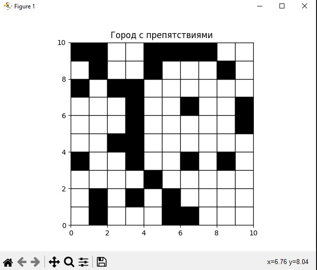
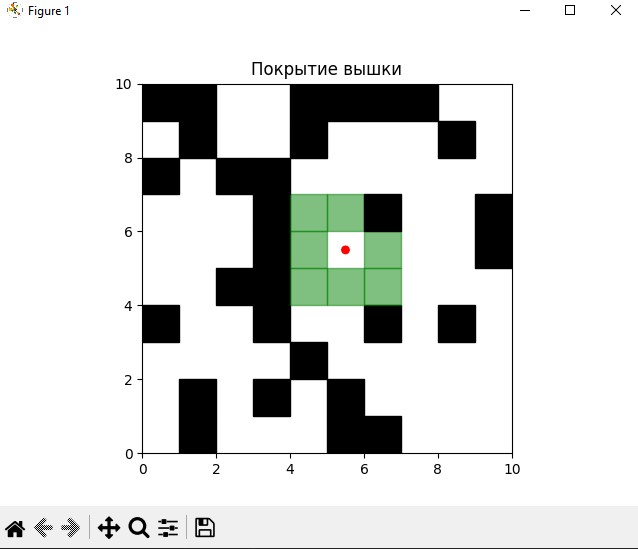
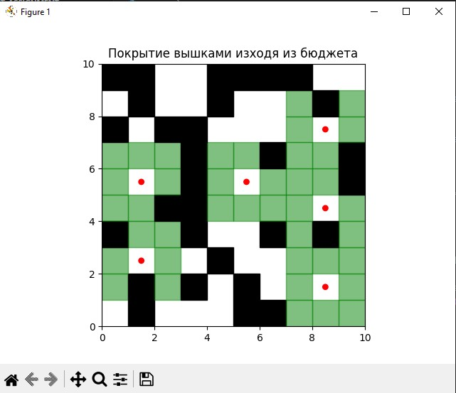
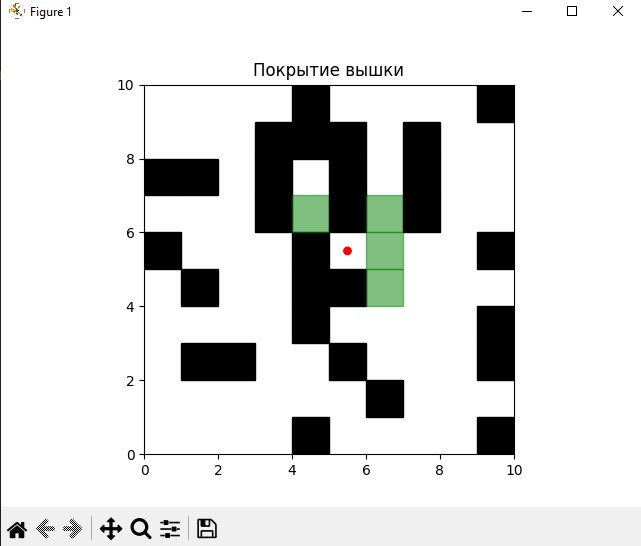
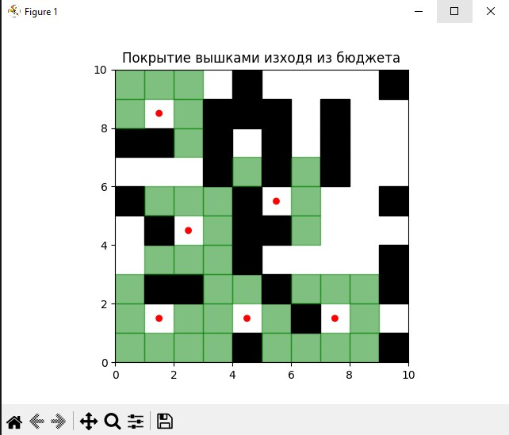
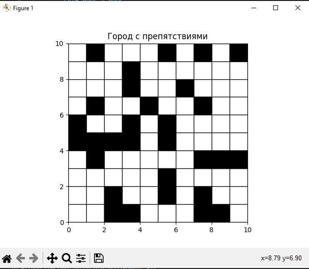
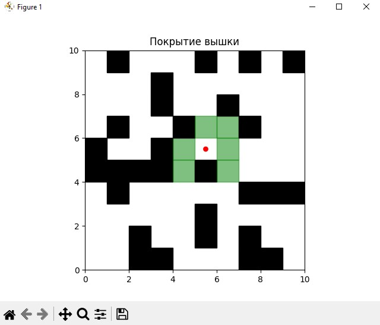
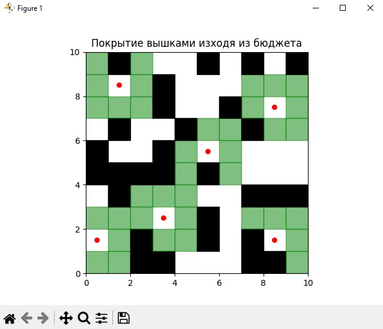
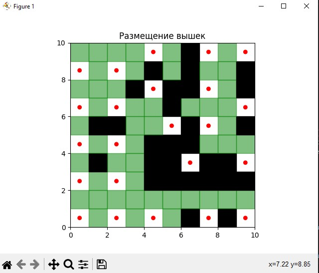

# Test-assignment
Test assignment  for the Junior Python Developer position

# Project launch

1. git clone git@github.com:Danila-19/Test-assignment.git
2. python -m venv venv
3. source venv/Scripts/activate
4. pip install -r requirements.txt
5. python main.py

# 1 Пример

# 2 Пример

# 3 Пример

# Покрытие вышками без учета бюджета 

